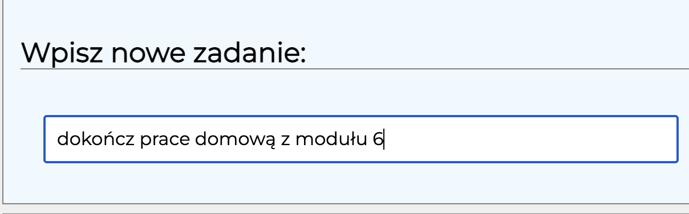
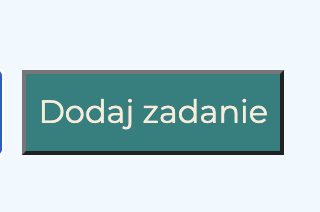
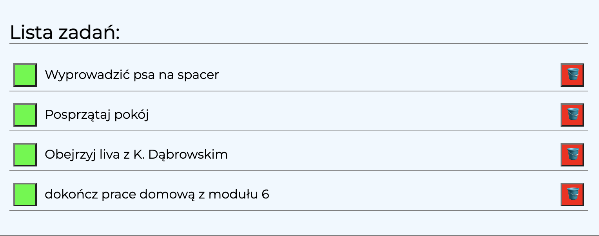
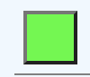
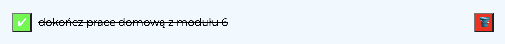
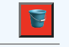
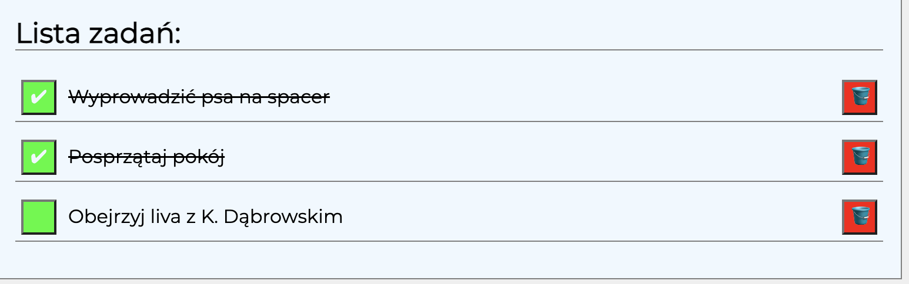

# Hey, this is a simple to-do list. Made in pure JS 🙂

## Demo:
https://andriistafiniak.github.io/task-list/

## Technologies used:
- HTML
- CSS
- Grid
- Media queries
- JavaScript
- BEM Convention
- Normalize
- Markdown

## How it works?
### 1. Enter task

### 2.If you click the button you can add the task to the task list

### 3. To mark the task as done, click on the green button 

### 4. By clicking on the red button with the basket you will delete the task

