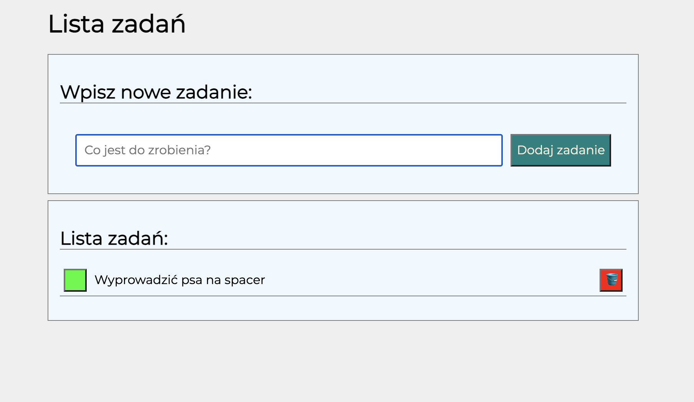

# Hey, this is a simple to-do list. Made in pure JS 🙂

## Demo:
https://andriistafiniak.github.io/task-list/

## Technologies used:
- HTML
- CSS
- Grid
- Media queries
- JavaScript
- BEM Convention
- Normalize
- Markdown

## How it works?

